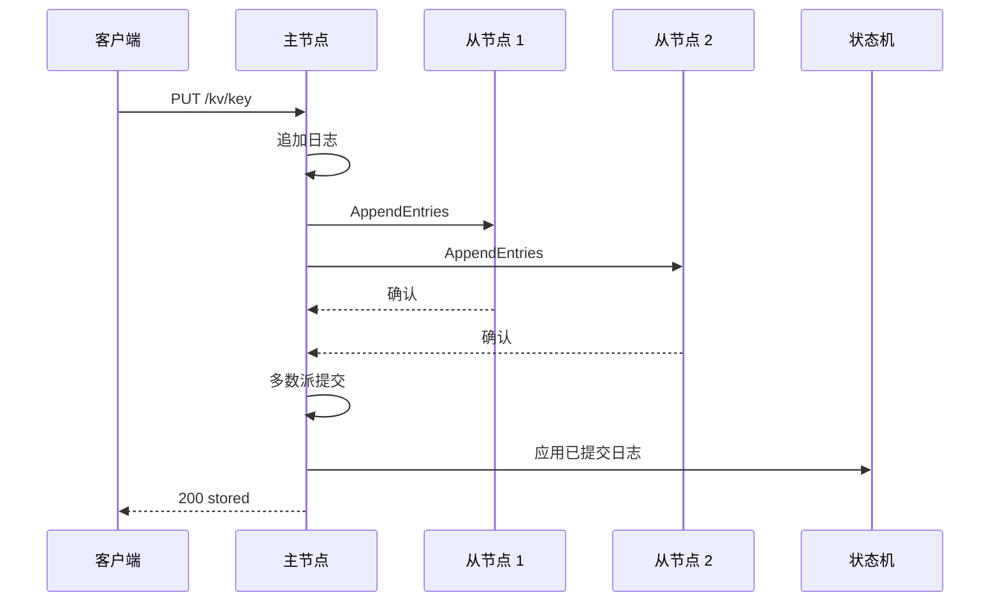
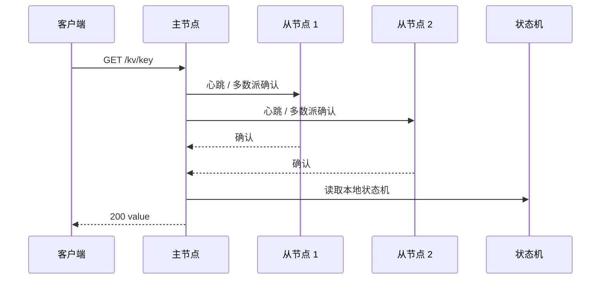

# 分布式 KV 架构说明

这份文档用于快速了解系统结构、核心数据流和故障恢复链路。

## 总体架构图

```mermaid
flowchart LR
  Client[客户端 / curl / 压测脚本]

  subgraph Service[节点服务]
    HTTP[HTTP 接口]
    Raft[RaftNode]
    RPC[TCP RPC + Protobuf]
    Metrics[/metrics 指标]
  end

  subgraph StateMachine[复制状态机]
    KV[KV]
    Lock[锁服务]
    MVCC[MVCC]
  end

  subgraph Storage[持久化层]
    Meta[Raft 元数据]
    Snap[快照]
    Rocks[RocksDB]
  end

  subgraph Cluster[其他节点]
    Peer1[节点 1]
    Peer2[节点 2]
  end

  Client --> HTTP
  HTTP --> Raft
  HTTP --> Metrics
  Raft --> RPC
  RPC --> Peer1
  RPC --> Peer2
  Raft --> KV
  Raft --> Lock
  Raft --> MVCC
  Raft --> Meta
  Raft --> Snap
  Meta --> Rocks
  Snap --> Rocks
  KV --> Rocks
  Lock --> Rocks
  MVCC --> Rocks
```

## 模块职责

- `RaftNode`：选举、日志复制、commit、apply、snapshot、成员关系维护
- `IRaftTransport` / `NetworkTransport`：抽象传输层，支持单进程 mock 和真实 TCP 网络版
- `NodeHttpServer` / `HttpServer`：暴露 KV、锁、MVCC、状态和指标接口
- `RocksDbKeyValueStore`：持久化状态机数据
- `RocksDbRaftPersistence`：持久化 `current_term`、`voted_for`、日志和 snapshot 元数据

## 写路径



## 读路径

当前实现不是“leader 直接读本地内存”，而是 ReadIndex 风格的线性一致读：



如果 leader 失去多数派，这个 quorum confirm 会失败，节点会拒绝读请求，而不是返回旧数据。

## 分区 / 故障恢复流程图

这个流程对应当前仓库里已经实现并测试过的 `Pre-Vote + 恢复追平` 场景。

```mermaid
sequenceDiagram
  participant L as 当前主节点
  participant M as 多数派从节点
  participant I as 被隔离从节点

  Note over L,M,I: 集群已经完成选主并稳定运行
  L->>M: AppendEntries / 心跳
  L--xI: 分区导致心跳丢失

  Note over I: 选举超时
  I->>L: PreVote(term+1)
  I->>M: PreVote(term+1)
  L--xI: 无响应
  M--xI: 无响应
  Note over I: 无法拿到多数派，不进入正式选举，不抬高 term

  L->>M: 继续发送心跳与日志复制
  Note over L,M: 多数派一侧继续稳定提供写入和线性一致读

  Note over I: 网络恢复
  L->>I: AppendEntries or InstallSnapshot
  I-->>L: 确认
  Note over I: 追平日志 / snapshot 后重新加入集群
```

## 结构要点

- 共识层、传输层、状态机、持久化层和接口层职责清晰，便于分别验证节点行为和数据路径
- 写路径的关键约束是“先完成日志复制与提交，再应用到状态机”
- 读路径的关键约束是“leader 先完成多数派确认，再返回状态机结果”
- 恢复路径的关键约束是“隔离节点先进行 Pre-Vote，恢复后由 leader 通过 AppendEntries 或 InstallSnapshot 追平”
